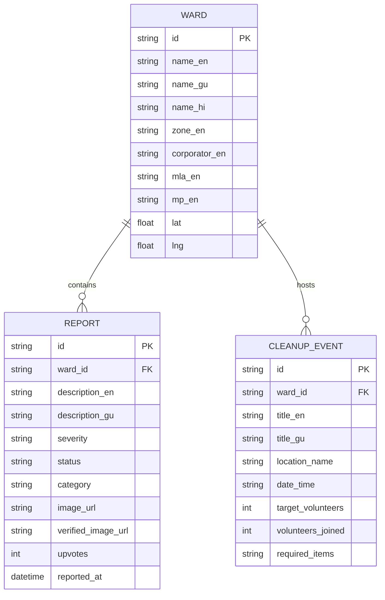

# 🧹 AmdavadSafai — અમદાવાદ સફાઈ

## Crowdsourced Garbage Reporting & Community Action Map for Ahmedabad

A civic-tech full-stack web application that enables citizens to track, report, and solve garbage and sanitation issues across Ahmedabad's municipal wards. Built with full **Gujarati (ગુજરાતી)**, **Hindi (हिंदी)**, and **English** language support.

> *"Don't just report the problem. Help solve it."* — **આપણું શહેર, આપણી જવાબદારી ❤️**

---

## 📑 Table of Contents

- [Overview](#overview)
- [Live Deployments](#live-deployments)
- [Tech Stack](#tech-stack)
- [Key Features](#key-features)
  - [1. Interactive Map & GeoJSON Boundaries](#1-interactive-map--geojson-boundaries)
  - [2. Trilingual Localization (GU, HI, EN)](#2-trilingual-localization-gu-hi-en)
  - [3. Sunday Community Cleanup Drives](#3-sunday-community-cleanup-drives)
  - [4. WhatsApp & Instagram Story Share Cards](#4-whatsapp--instagram-story-share-cards)
  - [5. Citizen Impact & Karma Gamification](#5-citizen-impact--karma-gamification)
  - [6. Civic Representative Accountability](#6-civic-representative-accountability)
  - [7. AMC SWM Solid Waste Feed & Analytics](#7-amc-swm-solid-waste-feed--analytics)
- [Data Model & Architecture](#data-model--architecture)
- [Getting Started](#getting-started)
- [API Documentation](#api-documentation)
- [License](#license)

---

## Overview

**AmdavadSafai** (અમદાવાદ સફાઈ) is an open civic-tech platform connecting citizens, community volunteers, and municipal representatives across all **27 wards** and **7 zones** of Ahmedabad.

Citizens can:

- View active garbage hotspots on an **interactive map** with AMC ward boundary overlays.
- Submit geolocated garbage reports with category selection and photo evidence.
- Verify cleaned spots with **Before → After proof photos**.
- Join or organize neighborhood **Sunday Cleanup Drives (સફાઈ અભિયાન)**.
- Generate branded social cards for **WhatsApp Status & Instagram Stories**.
- Earn **Citizen Karma Points** and rank badges for civic contributions.
- Access elected representative hierarchies (Corporator, MLA, MP) and AMC control room escalation.

---

## Live Deployments

- **Web Application (Vercel)**: [https://amdavad-safai-9i9g.vercel.app/](https://amdavad-safai-9i9g.vercel.app/)
- **Backend API Docs (Render)**: [https://amdavadsafai.onrender.com/docs](https://amdavadsafai.onrender.com/docs)
- **GitHub Repository**: [https://github.com/andrewshiva/AmdavadSafai.git](https://github.com/andrewshiva/AmdavadSafai.git)

---

## Tech Stack

| Layer | Technology | Description | License |
| :--- | :--- | :--- | :--- |
| **Frontend Framework** | React 18+ & Vite | Fast, responsive Single Page Application | MIT |
| **Mapping Engine** | MapLibre GL JS | GPU-accelerated vector mapping & GeoJSON | BSD-3-Clause |
| **Backend API** | FastAPI (Python 3.12) | High-performance async REST API | MIT |
| **Database & ORM** | SQLite + SQLAlchemy | Relational storage with auto-migrations | MIT |
| **Design System** | Bangalore UI & Glassmorphism | High-contrast civic UI with dark/light tokens | MIT |
| **Charts & Visuals** | Recharts & HTML5 Canvas | Dynamic analytics charts & card export | MIT |
| **Icons** | Lucide React | Clean, scalable vector icon family | MIT |
| **Hosting & Proxy** | Vercel (Edge) + Render | Production cloud infrastructure with SSL | Free Tier |

---

## Key Features

### 1. Interactive Map & GeoJSON Boundaries

- **GPU Vector Mapping**: Powered by MapLibre GL with smooth zooming and panning across Ahmedabad.
- **Ward Boundary Overlays**: Precision GeoJSON boundaries for all 27 AMC wards with dynamic cleanliness score heatmaps.
- **Severity Color Coding**: Green (Minor), Yellow (Moderate), Orange (Severe), Red (Critical).
- **Cluster Aggregation**: Smooth circle clusters at city zoom that expand to individual pins when zooming in.

### 2. Trilingual Localization (GU, HI, EN)

- **3-Way Instant Toggle**: Seamless switching between **ગુજરાતી (Gujarati)**, **हिंदी (Hindi)**, and **English**.
- **Comprehensive Translations**: Over 140 dictionary keys covering forms, analytics, representatives, and instructions.
- **Anti-Tampering Guard**: Protected with `notranslate` metadata to prevent external browser translation extensions from crashing React DOM trees.

### 3. Sunday Community Cleanup Drives

- **Civic Action Drives**: Citizens can view upcoming community drives scheduled across Ahmedabad landmarks.
- **1-Click RSVP**: Residents can join drives with one click (`+50 pts` karma earned) with real-time volunteer count updates.
- **Organize a Drive**: Simple form to organize a drive with meeting point, supplies needed, and volunteer goals.

### 4. WhatsApp & Instagram Story Share Cards

- **Dynamic Canvas Generation**: Generates 640x800 high-resolution branded cards with Ahmedabad typography and slogans.
- **Direct 1-Click WhatsApp Sharing**: Opens WhatsApp with pre-filled message text and direct map links.
- **PNG Download**: One-click download for Instagram Story posts.

### 5. Citizen Impact & Karma Gamification

- **Civic Point Rewards**:
  - `+10 pts` for reporting a garbage issue
  - `+25 pts` for verifying a cleaned spot
  - `+50 pts` for joining a Sunday cleanup drive
  - `+100 pts` for organizing a community drive
- **Citizen Rank Badges**:
  - 🥉 **Safai Sevak** (Level 1)
  - 🥈 **Ward Guardian** (Level 2)
  - 🥇 **Amdavad Safai Warrior** (Level 3)
  - 👑 **Eco Champion** (Level 4)

### 6. Civic Representative Accountability

- **Elected Representative Hierarchy**: Every report and ward card connects to the Municipal Corporator, Ward MLA (Gujarat Vidhan Sabha), and Member of Parliament (Lok Sabha).
- **Official AMC Escalation**: Quick dial AMC Control Room (`155303`) or escalate directly on X (Twitter).

### 7. AMC SWM Solid Waste Feed & Analytics

- **Daily AMC Municipal Data**: Door-to-door coverage (94.6%), active collection vehicles (842+), daily waste processed (4,120 tons), recycling rate (68.2%).
- **Zone & Severity Analytics**: Interactive Recharts breakdown and city-wide ward resolution leaderboard.

---

## Data Model & Architecture



---

## Getting Started

### Prerequisites

- Node.js 18+
- Python 3.10+ (optional for local backend)

### Installation & Local Setup

```bash
# Clone the repository
git clone https://github.com/andrewshiva/AmdavadSafai.git
cd AmdavadSafai

# Install frontend dependencies
npm install

# Start Vite development server
npm run dev
```

### Running the Python Backend (Optional)

```bash
cd backend
pip install -r requirements.txt
uvicorn app.main:app --reload --port 8000
```

---

## API Documentation

When the backend server is running, explore the interactive OpenAPI documentation:

- **Swagger UI**: [https://amdavadsafai.onrender.com/docs](https://amdavadsafai.onrender.com/docs)
- **ReDoc**: [https://amdavadsafai.onrender.com/redoc](https://amdavadsafai.onrender.com/redoc)

### Key Endpoints

- `GET /api/wards` — List all 27 Ahmedabad municipal wards
- `GET /api/reports` — List and filter civic garbage reports
- `POST /api/reports` — Register a new garbage complaint
- `POST /api/reports/{id}/verify` — Verify cleanup with photo evidence
- `GET /api/events` — List upcoming Sunday cleanup drives
- `POST /api/events/{id}/join` — RSVP join a cleanup drive

---

## License

MIT License — Built with pride for the citizens of Ahmedabad.

---

> 🧹 **AmdavadSafai** — આપણું શહેર, આપણી જવાબદારી
