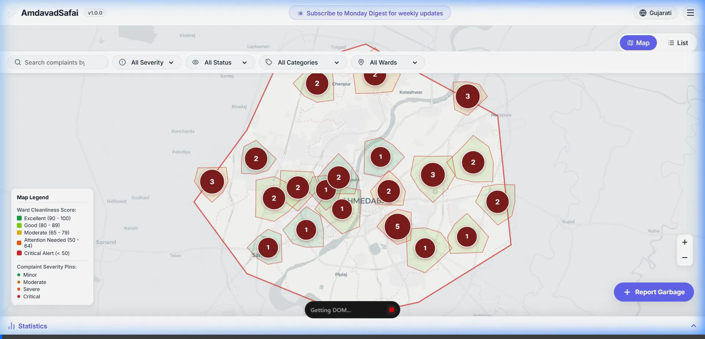
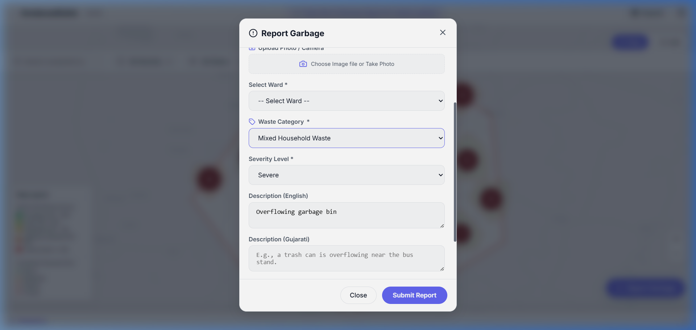

# Standard Operating Procedure (SOP): Using the AmdavadSafai Platform

Welcome to **AmdavadSafai**, the crowdsourced garbage reporting and civic action map for Ahmedabad. This platform empowers you to report uncollected waste, track ward cleanliness, and verify municipal cleanup efforts in real-time.

This SOP outlines the standard steps for citizens to effectively use the platform.

---

## 1. Accessing the Platform & Basic Navigation

1. **Open the Application**: Navigate to the platform's URL via your web browser on mobile or desktop.
2. **Language Selection**:
   - Use the language toggle button at the top-right corner to switch between **English** and **Gujarati**.
   - All menus, map labels, and interactive forms will instantly translate to your preferred language.
3. **View Modes**:
   - Use the toggle switch in the top-right corner to switch between **Map View** (visual overview) and **List View** (scrollable feed of reports).

---

## 2. Viewing the City Overview & Filtering

Before creating a report, you can check existing complaints and overall ward performance.

1. **Filtering Reports**: Use the top filter bar to narrow down complaints by:
   - **Severity**: Minor, Moderate, Severe, Critical.
   - **Status**: Unresolved, Resolved.
   - **Category**: Mixed Waste, Overflowing Bin, Construction Dump, Roadside Garbage, Drainage Blockage.
   - **Wards**: Select a specific ward to make the map automatically zoom and fly to that area.
2. **Ward Cleanliness Grades**: 
   - The map colors each ward based on its cleanliness score. Click on any ward to see its detailed score card (from *Excellent* to *Critical Alert*).
3. **Viewing Statistics**:
   - Click the **Statistics** button at the bottom of the screen to slide up the dashboard.
   - Here you can view the official **AMC SWM Feed** (collection vehicle count, door-to-door coverage, daily waste processed) and the **Ward Cleanliness Leaderboard** to see how your ward ranks compared to others.

---

## 3. Reporting a Garbage Issue

If you spot uncollected garbage, an overflowing bin, or a blocked drain, report it to alert the authorities and the community.

1. **Initiate Report**: Click the large, floating **"+" (Plus) Button** at the bottom right corner of the screen.
2. **Select Location**:
   - The app will attempt to auto-detect your location using your device's GPS.
   - Alternatively, you can click on the interactive map to precisely drop a pin where the garbage is located.
   - *Note: If you drop a pin outside the Ahmedabad Municipal limits, the system will alert you.*
3. **Add Photo Evidence (Optional but Recommended)**: Upload a clear picture of the site.
4. **Fill Details**:
   - Select the waste **Category** and the **Severity** of the issue.
   - Add a brief **Description** of the problem.

5. **Submit**: Click **Submit Report**. Your report will instantly appear as a glowing dot on the map.

> [!TIP]
> Always try to attach a photo when making a report. Visual evidence drastically increases the priority and likelihood of a swift resolution by AMC workers.

---

## 4. Community Engagement: Upvoting, Verifying, & Flagging

You can interact with reports submitted by your fellow citizens to ensure accuracy and foster accountability. Click on any report pin on the map or in the List View to open its details.

### A. Upvoting an Unresolved Report
If you see the same garbage issue in your area, do not create a duplicate report. 
- Open the existing report and click the **Upvote (👍)** button. This raises the priority of the complaint.

### B. Verifying a Cleanup
If a report is marked as "Unresolved", but you notice the AMC has cleared the area:
- Open the report and click **Verify Cleanup**.
- You will be prompted to upload a new photo of the clean spot as proof.
- Once submitted, the report's status will change to **Resolved** and the map pin will turn green.

### C. Flagging Fake or Disputed Reports
If you find a report that is fake, duplicate, or abusive:
- Click the **Flag (🚩)** button on the report.
- Select a reason for flagging. If enough citizens flag a report, it will be marked for administrative review.

---

## 5. Using the Platform Offline (No Internet)

AmdavadSafai is built to work even when you lose your internet connection or run out of mobile data on the street.

1. **Offline Browsing**: You can still browse the map and view recently loaded reports without an active connection.
2. **Offline Actions**: 
   - If you **Upvote**, **Verify a Cleanup**, or **Flag** a report while offline, the app will securely save your actions to your device.
   - As soon as your device reconnects to the internet, these actions will automatically sync with the server.

> [!IMPORTANT]
> To submit a *brand new* report with a photo, an active internet connection is highly recommended to ensure the heavy image file uploads correctly.

---

## 6. Escalating Issues

If a critical report remains unresolved for a long time, use the escalation tools inside the report details:
- **X (Twitter)**: Click the "Escalate on X" button to generate a pre-filled tweet tagging the official AMC handles and your local representatives.
- **Direct Call**: Use the provided button to instantly dial the AMC Control Room.
